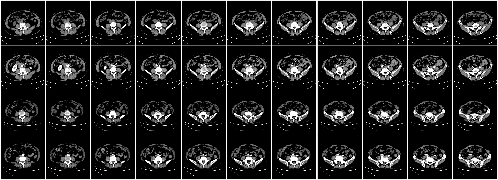
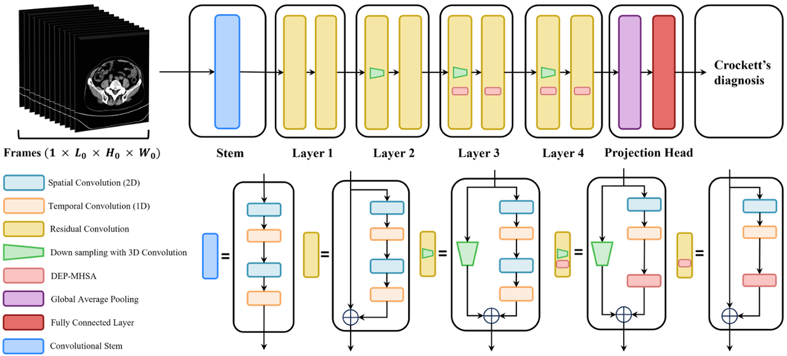
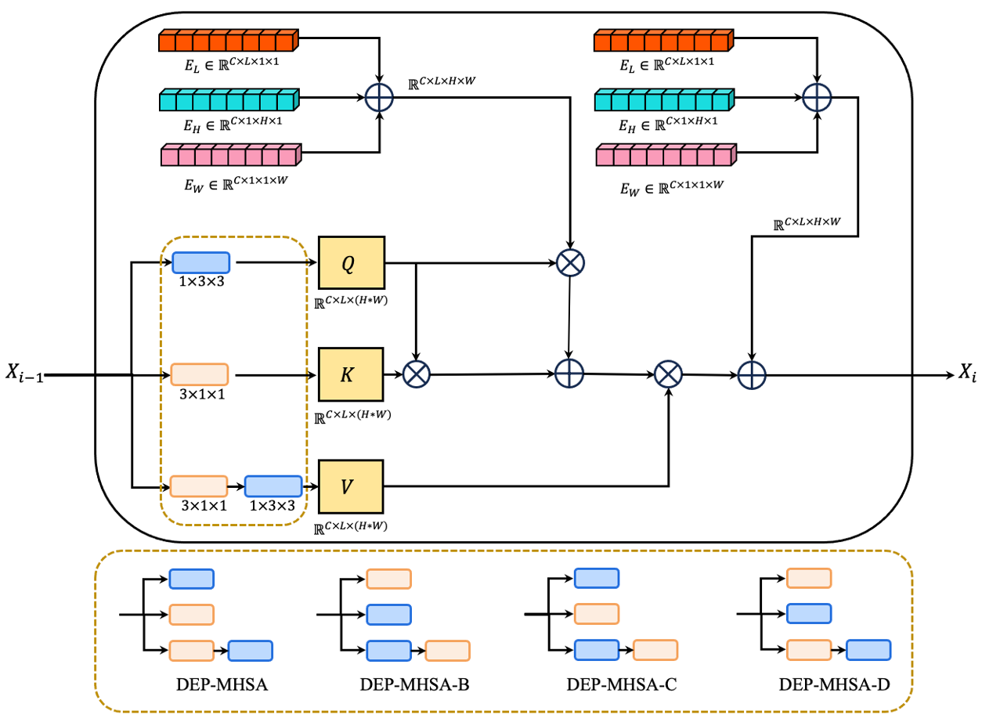

# DEP-MHSA: Dual-Enhanced Position Embedding of Multi-Head Self Attention for May-Thurner Syndrome Diagnosis


<center>
    
    <br>
    <div style="color:orange; border-bottom: 1px solid #d9d9d9;
    display: inline-block;
    color: #999;
    padding: 2px;">Samples of CT scans and Enhanced CT scans that collected in this study.</div>
</center>

## Overview
Welcome to the official repository of **DEP-MHSA**, a state-of-the-art deep learning network designed for the accurate diagnosis of May-Thurner Syndrome using advanced self-attention mechanisms.

<center>
    
    <br>
    <div style="color:orange; border-bottom: 1px solid #d9d9d9;
    display: inline-block;
    color: #999;
    padding: 2px;">The main structure of our proposed network.</div>
</center>


## Features
- **Dual-Enhanced Position Embedding (DEP)**: A unique embedding technique that improves the network's understanding of temporal-spatial relationships in medical images.

- **Expert-like Multi-Head Self-Attention (MHSA)**: The techniques used to generate the Key, Query, and Value matrices in our model draw inspiration directly from medical expertise. The efficacy of this structure has been rigorously validated through a comprehensive ablation study and comparative analysis with networks of similar scale.

- **High Accuracy and Precision**: Rigorously tested on the collected CT scan datasets, which achieved highest performance across F1-Score, Accuracy and AUC.


## Network Structure 
The figure illustrates the main architecture of the DEP-MHSA network. Our model leverages advanced neural network techniques to enhance feature extraction and improve diagnostic accuracy.

<center>
    
    <br>
    <div style="color:orange; border-bottom: 1px solid #d9d9d9;
    display: inline-block;
    color: #999;
    padding: 2px;">DEP-MHSA and its variants.</div>
</center>


## Getting Started
To use `DEP-MHSA` in your research or clinical practice, follow these steps:

1. Clone the repository: `git clone https://github.com/Nutingnon/MTS-DepMhsa.git`
2. Install dependencies: `pip install -r requirements.txt`
3. Follow the detailed usage instructions in the [Documentation]().

## Data Acquisition
You can achieve data through [Google Drive](https://drive.google.com/file/d/1DZ7wyg6ATCzNFqAbawQorg-PjtN0aBhL/view?usp=drive_link)

The data contains:
- `./anonymized_ct_scans/` a directory containing **CT** scans images of `747` subjects.
- `./anonymized_enhanced_ct_scans` a directory containing **enhanced CT** scans images of `366` subjects.
- `public_label_table.csv` a `.csv` file contains 2 columns, `patient_name` is the column indicating anonymized patient name, `label` column contains binary values as `0` and `1`

If you are interested in the method of preprocessing, please refer to the script `cdta_preprocess.py`

## Contributing
We welcome contributions to the **DEP-MHSA** project! Please read our [Contributing Guidelines]() for more information on how you can contribute.

## License
**DEP-MHSA** is released under the MIT License.

## Citation
If you use DEP-MHSA or our collected dataset in your research, please cite our paper:

```
BibTeX entry of the publication
```